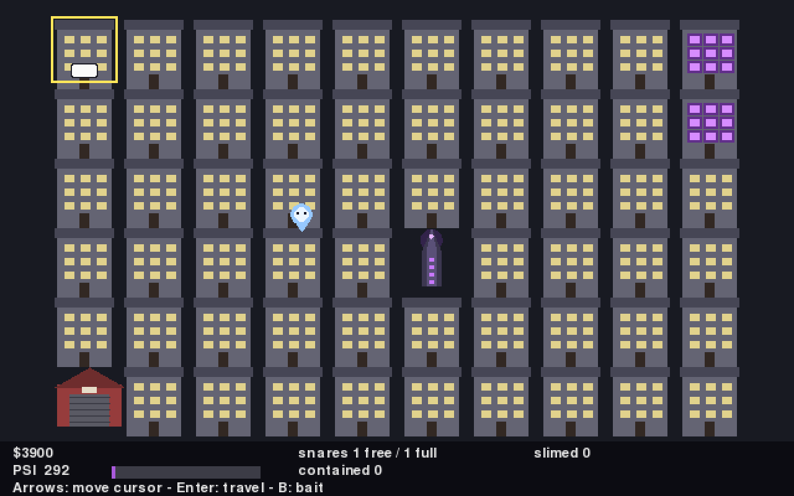
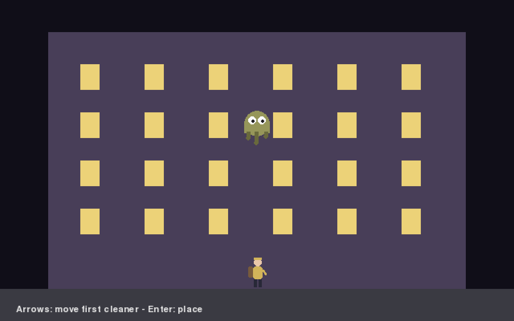

# Psychic Cleaners

A clean-room [pygame-ce](https://pyga.me) homage to a 1984 Activision C64 classic about
running a paranormal-removal franchise: buy a vehicle and gear, watch the city map, drive
to hauntings, snare stain-ghosts between two beams, dodge a rampaging gummy mascot, and —
when the city's psychic residue maxes out — storm Threshold Tower. Mechanics and pacing
follow the original; every name, sprite, sound, and melody is an original work. The full
concept-by-concept theme mapping is in
[docs/superpowers/specs/2026-07-13-psychic-cleaners-design.md](docs/superpowers/specs/2026-07-13-psychic-cleaners-design.md)
(section 3).

  
  

Every sprite, sound, and melody shown above is generated in code at startup — no image or
audio assets ship in this repo (see `shell/gfx.py` and `shell/audio.py`).

## Install

Requires Python >= 3.14 and [uv](https://docs.astral.sh/uv/).

    uv sync

## Play

    uv run psychic-cleaners

Win condition: end the finale with a bankroll strictly greater than the one you started
with. Your account code carries the bankroll into the next game.

## Controls

| Scene     | Keys                                                                         |
|-----------|------------------------------------------------------------------------------|
| Title     | Type your name; `Tab` switches between the Name and Account code fields; `Backspace` deletes; `Enter` confirms (blank code = new franchise, filled code = restore account) |
| Shop      | `Up`/`Down` select; `Enter` buy vehicle or item; `F` finish shopping           |
| City map  | Arrow keys move the cursor; `Enter` travel; `B` deploy gummy bait on an alert; `S` buy a snare at the Depot; `L` take a Depot loan; `P` repay a Depot loan |
| Driving   | `Up`/`Down` change lane; `B` deploy gummy bait on an alert                     |
| Busting   | `Left`/`Right` move cleaner or snare cursor; `Enter` place / lay snare; `Space` spring it; `B` deploy gummy bait on an alert |
| Finale    | `Space` send the next runner past the mascot                                   |
| Game over | `Enter` back to the title                                                      |

## Development

    uv run pytest                 # full suite (SDL dummy drivers set by tests/conftest.py)
    uv run ruff check .           # lint
    uv run ruff format .          # format
    uv run mypy                   # strict type-check of src and tests
    uv run pre-commit install     # ruff + mypy on every commit

CI additionally enforces >= 90% coverage on the pure-logic core:
`uv run pytest --cov=psychic_cleaners.core --cov-fail-under=90
--override-ini="addopts=--cov-report=term-missing"` (the override drops the package-wide
`--cov` from pyproject addopts so the gate measures `core/` only).

## Project layout

    src/psychic_cleaners/
      core/    # pure deterministic game logic — zero pygame imports
               # constants.py is the single tuning point for every gameplay number
      shell/   # all pygame-ce code: app loop, generated sprites/audio, one module per scene
    tests/
      core/         # fast unit + Hypothesis property tests
      integration/  # scripted full-playthrough tests of core.game (no pygame)
      shell/        # SDL dummy-driver smoke tests

The shell feeds `Command` objects into `core.game.Game.tick`, which returns `Event`
objects; the shell draws state and plays a sound per event. Same seed + same commands =
same game, which is what makes the playthrough tests deterministic.

## License

Public domain — see [LICENSE](LICENSE) ([The Unlicense](https://unlicense.org)).
